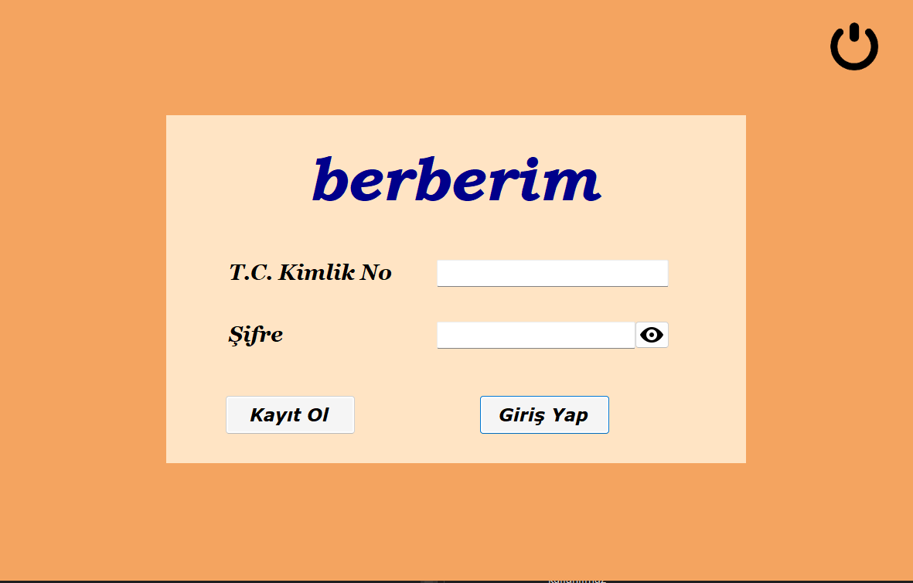
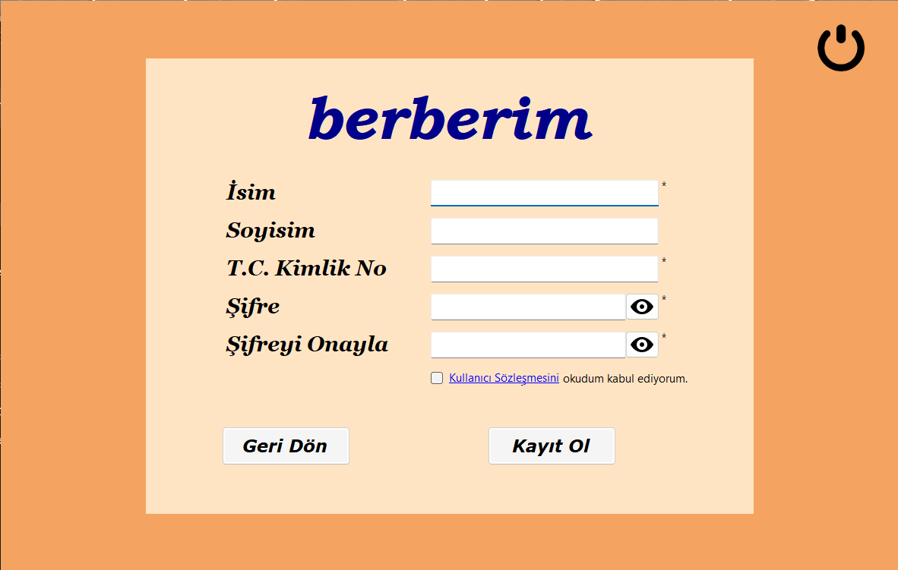
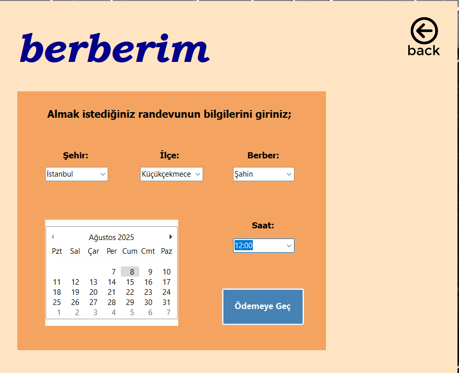
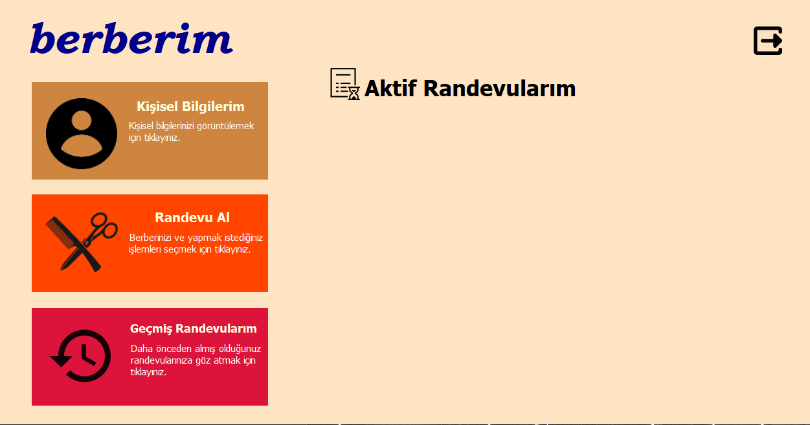

# Berberim – Online Barber Appointment System

## 📌 Overview
**Berberim** is a desktop-based appointment management system for barber shops, developed as a team project for the **Visual Programming** course.  
It allows customers to **find nearby barber shops, view services & prices, and book appointments in real-time**.  
The system is designed with **robust validation** and **multi-user support**, simulating a commercial-grade application.

This was a **team project** consisting of:  
- 2 Developers (including myself)  
- 1 Business Analyst  

---

## 🛠 Tech Stack
- **Language:** C# (WinForms)  
- **Database:** Microsoft SQL Server  
- **IDE:** Visual Studio  
- **Architecture:** Desktop Application with SQL Backend

---

## ✨ Key Features
- **User Authentication & Registration**
  - Secure login & sign-up with **TC and password validation**
  - Privacy policy acceptance for new users

- **Barber Shop Listings**
  - View nearby barber shops with addresses and distance info
  - Display **service lists & prices**

- **Appointment Management**
  - Real-time **appointment booking** with conflict prevention  
  - Appointment **cancellation & rescheduling**  
  - Prevents **double-booking for the same time slot**

- **Database Integration**
  - All appointments, users, and barber data stored in **SQL Server**
  - Automatic conflict detection in appointment times

- **Robust Validation**
  - Password & ID checks, empty field detection  
  - Error messages and user-friendly feedback

---

## 📷 Screenshots

Log-in:
|

Sign-in:

Appointment Booking:

HomePage:

---

## 📂 Repository Contents
- `Source/` → Full Visual Studio project  
- `Database/` → SQL scripts & sample data  
- `Screenshots/` → Example UI screenshots  
- `README.md` → Project overview

---

## 🚀 How to Run
1. Clone or download the repository
2. Open the solution in **Visual Studio**
3. Restore the **SQL database** from the provided script
4. Update the **connection string** if needed
5. Run the project and log in with a sample user (provided in the database)

---

## 📌 Notes
- This was a **course project**, but designed to mimic a **real-world appointment system**.
- Developed collaboratively in a **team of 3** (2 devs + 1 analyst).

